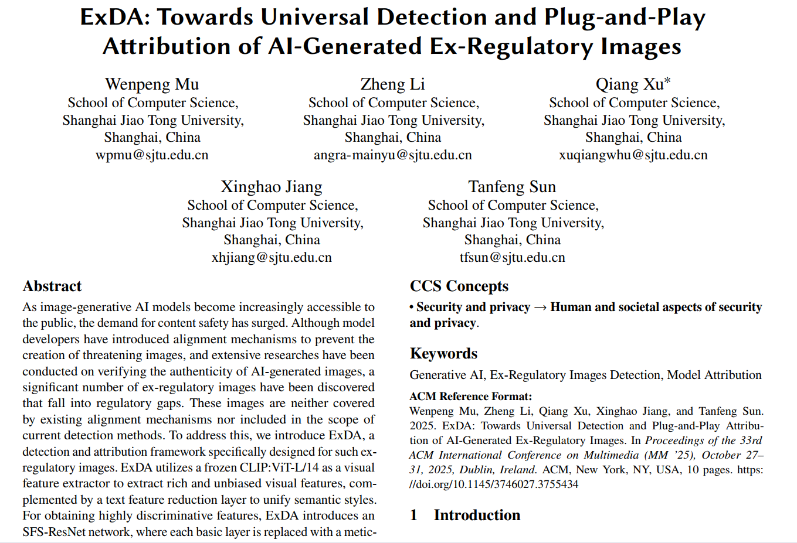
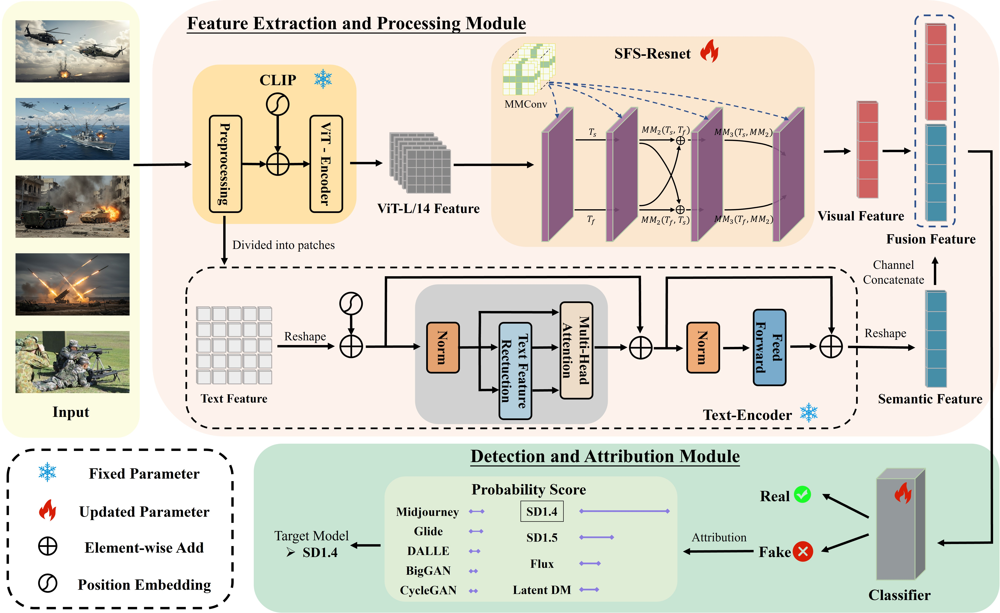

# [ExDA: Towards Universal Detection and Plug-and-Play Attribution of AI-Generated Ex-Regulatory Images]

<p align="center">
  
  
  
  
</p>

<div align="center">
  <b><a href="README.md">中文</a></b> •
  <a href="README_en.md">English</a>
</div>

---

本项目是会议论文 **ExDA: Towards Universal Detection and Plug-and-Play Attribution of AI-Generated Ex-Regulatory Images** (ACM MM'25) 的官方实现。

**论文链接: https://doi.org/10.1145/3746027.3755434**

## ✅ 摘要
随着图像生成式AI模型日益普及，公众对内容安全的需求急剧增长。尽管模型开发者已引入对齐机制来阻止威胁性图像的生成，且关于AI生成图像真实性的验证研究已广泛开展，但仍有大量"监管外图像"被发现游离于现有监管体系之外——这些图像既未被现有对齐机制覆盖，也不在当前检测方法的识别范围内。

为此，我们提出ExDA检测溯源框架，专门针对这类监管外图像。该系统采用冻结参数的CLIP:ViT-L/14作为视觉特征提取器，获取丰富且无偏见的视觉特征，并通过文本特征降维层统一语义风格。为获得高区分度特征，ExDA创新性地设计了SFS-ResNet网络，其基础层均被我们精心设计的"多通道边界卷积(MMConv)"模块替代。检测器后端还集成了即插即用的多代模型溯源组件。

鉴于现有公开数据集中缺乏监管外图像样本，我们构建了包含72,000张此类图像的ExImage数据集用于验证。实验表明：ExDA在ExImage上达到99.07%的平均检测准确率；在跨数据集测试中，相较于GenImage和高难度Chameleon数据集分别实现+5.73%和+10.36%的性能提升。值得注意的是，ExDA在溯源任务中同样表现优异，展现出识别生成模型内在指纹的卓越能力。

项目代码已开源：https://github.com/mwp-create-wonders/ExDA


<p align="center">
  
  <br>
  <em>图1: 论文首页</em>
</p>

## ⚙️ 模型架构

我们的核心模型 **ExDA** 由 **视觉特征提取模块 (CLIP:ViT-L/14)**、**专用特征处理网络 (SFS-ResNet)** 以及 **解耦的文本编码器** 组成。

其关键创新在于：
1.  创新性地在 **SFS-ResNet** 中使用 **MMConv** 替换基础层，以高效过滤冗余信息并捕获高频判别性特征。
2.  在文本编码器中引入 **文本特征降维层**，以最大限度地降低图像内容对检测过程的干扰，使模型专注于伪造痕迹。

<p align="center">
  
  <br>
  <em>图2: 整体框架图</em>
</p>


## ✨ 主要特性

*   **高效的检测与溯源框架 (ExDA)**: 我们提出了一个名为 **ExDA** 的高效框架，专为AI生成的特殊监管图像提供精准的检测与可靠的溯源。

*   **鲁棒的视觉特征处理**: 采用冻结的 **CLIP:ViT-L/14** 作为骨干，确保获取无偏且鲁棒的视觉特征。结合我们独创的 **SFS-ResNet** 网络（其核心为 **MMConv**），它能高效过滤冗余信息，并捕获用于区分真伪的高频判别性特征。

*   **抗内容干扰设计**: 通过解耦文本编码器并引入 **文本特征降维层**，ExDA能最大程度地减少图像具体内容对检测结果的干扰，使模型更专注于生成痕迹本身，而非图像语义。

*   **即插即用的溯源能力**: 框架包含一个高扩展性的 **溯源插件**。该插件具备小样本学习能力，仅需少量来自未知生成模型的图像，即可快速学习其底层指纹，有效解决现实世界中的责任追溯问题。

*   **首创的专用数据集 (ExImage)**: 针对此特定领域，我们构建并开源了 **ExImage 数据集**。该数据集填补了特殊监管图像检测领域的空白，对维护社会稳定与公共安全具有重要意义。

## 📚 ExImage数据集


## 🚀 快速开始

### 1. 环境配置

我们建议使用 Conda 来管理依赖环境。

```bash
# 克隆本仓库
git clone https://github.com/[你的Github用户名]/[你的仓库名].git
cd [你的仓库名]

# 创建并激活Conda环境
conda create -n [你的环境名] python=3.8
conda activate [你的环境名]

# 安装依赖
# requirements.txt 应包含如 pytorch, torchvision, numpy, tqdm 等所有依赖
pip install -r requirements.txt
```

### 2. 数据准备

请从 [数据来源链接] 下载 [数据集名称] 数据集，并将其解压至 `data/` 目录下。目录结构应如下所示：

```
[你的仓库名]/
├── data/
│   ├── [数据集名称]/
│   │   ├── train/
│   │   └── test/
├── src/
└── README.md
```

### 3. 预训练模型

你可以从 [Hugging Face Hub / Google Drive / 百度网盘链接] 下载我们训练好的模型权重。

将下载的 `.pth` 或 `.pt` 文件放入 `checkpoints/` 文件夹中。

### 4. 评估

使用以下命令在 [数据集名称] 的测试集上评估我们的预训练模型：

```bash
python evaluate.py \
    --model_name [你的模型名] \
    --checkpoint_path checkpoints/[你的模型权重文件名].pth \
    --data_dir data/[数据集名称]
```

### 5. 训练

如果你想从头开始训练模型，请运行：

```bash
# 单GPU训练
python train.py \
    --model_name [你的模型名] \
    --data_dir data/[数据集名称] \
    --epochs 100 \
    --batch_size 64 \
    --learning_rate 1e-4

# (可选) 多GPU训练
# torchrun --nproc_per_node=[GPU数量] train.py ...
```

## 📊 实验结果

我们在多个基准上验证了我们方法的有效性。

<!-- 表格：这是另一种形式的“图表”，非常适合展示量化结果 -->
### 在 [数据集A] 上的性能对比

| 方法         | Backone  | Accuracy (%) | F1-Score |
|--------------|----------|--------------|----------|
| Baseline     | ResNet-50| 85.2         | 0.84     |
| Method X     | ResNet-50| 87.5         | 0.87     |
| **Ours**     | ResNet-50| **89.1**     | **0.89** |
| **Ours**     | ViT-Base | **91.3**     | **0.91** |

<!-- 示意图3：性能曲线图或可视化结果对比图 -->
<!-- 这可以是训练过程中的 Loss/Accuracy 曲线，或是输入/输出的直观对比 -->
<p align="center">
  
  <br>
  <em>图3: 在 [数据集A] 上的训练准确率曲线</em>
</p>

## 🤝 如何贡献

我们非常欢迎社区的贡献！如果你有任何想法或发现了 bug，请随时：

1.  Fork 本仓库
2.  创建你的特性分支 (`git checkout -b feature/AmazingFeature`)
3.  提交你的更改 (`git commit -m 'Add some AmazingFeature'`)
4.  推送到分支 (`git push origin feature/AmazingFeature`)
5.  创建一个 Pull Request

## 📜 开源许可

本项目采用 [MIT License](LICENSE) 开源许可。

## 🎓 如何引用

如果我们的工作对你的研究有所帮助，请考虑引用我们的论文：

```bibtex
@inproceedings{[你的引用标签],
  author    = {[作者A] and [作者B]},
  title     = {[你的论文标题]},
  booktitle = {[会议名称]},
  year      = {[年份]}
}
```

## 🙏 致谢

*   感谢 [某某组织或个人] 提供的计算资源。
*   本项目的代码结构参考了 [某个优秀开源项目] 的实现。

