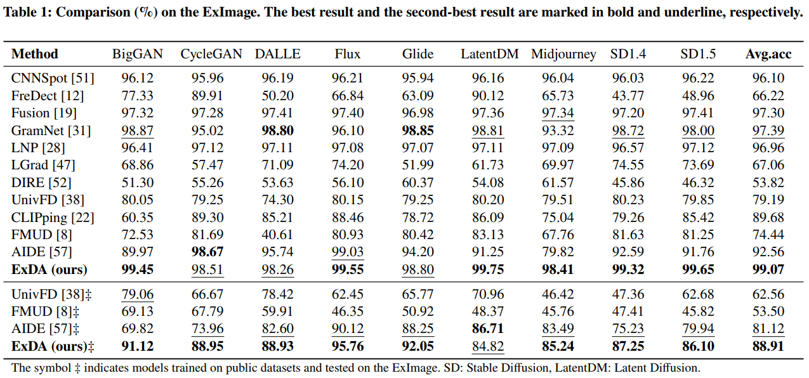
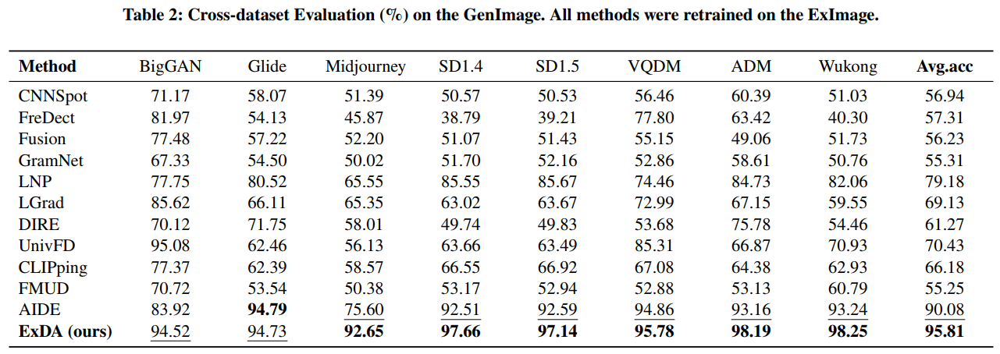
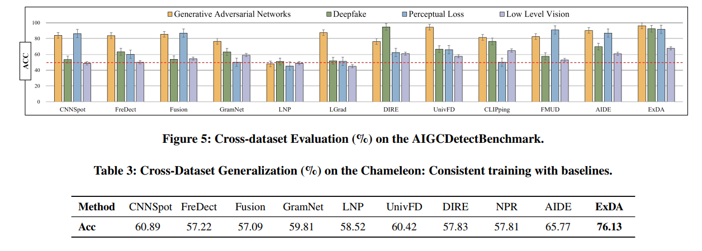

# [ExDA: Towards Universal Detection and Plug-and-Play Attribution of AI-Generated Ex-Regulatory Images]

<p align="center">
  
  
  
  
</p>

<div align="center">
  <b><a href="README.md">中文</a></b> •
  <a href="README_en.md">English</a>
</div>

---

本项目是会议论文 **[ExDA: Towards Universal Detection and Plug-and-Play Attribution of AI-Generated Ex-Regulatory Images](https://doi.org/10.1145/3746027.3755434)** (ACM MM'25) 的官方实现。


## 📰 最新动态
-[2025-08-28] 🎉 我们整理发布ExImage数据集，现在可以访问[Google Drive](https://drive.google.com/file/d/1s2JYbZyMe-SzWjkja9tlZFrzIJiFhwI-/view?usp=sharing)下载啦！！

-[2025-08-17] 🎉 我们更新了绘制功率谱图的关键步骤说明，可以按照【快速开始】中的指引进行绘制！

-[2025-08-15] 🎉 我们最新的一篇综述工作已经被ACM Computing Surveys期刊接受，题目为[Advancements in AI-Generated Content Forensics: A Systematic Literature Review](https://doi.org/10.1145/3760526)。欢迎各位同仁阅读并批评指正，如对您的研究有帮助，欢迎**引用**！

-[2025-08-15] 🎉 我们更新了测试代码validate.py和工具文件earlystop.py，可以按照【快速开始】中的指引进行测试！

-[2025-08-11] 🎉 我们更新了预训练权重，现在可以访问[Google Drive](https://drive.google.com/file/d/1K7Otqbcx5vkNEciRtMgXXF9IVbb5cEgi/view?usp=sharing)下载啦！

-[2025-08-10] 🎉 我们更新部分代码，在data/文件夹下可以查看ExImage和GenImage功率谱图！

-[2025-07-06] 🎉 我们论文正式被ACM MM'25接受！

## 🔍 摘要
随着图像生成式AI模型日益普及，公众对内容安全的需求急剧增长。尽管模型开发者已引入对齐机制来阻止威胁性图像的生成，且关于AI生成图像真实性的验证研究已广泛开展，但仍有大量"监管外图像"被发现游离于现有监管体系之外——这些图像既未被现有对齐机制覆盖，也不在当前检测方法的识别范围内。

为此，我们提出ExDA检测溯源框架，专门针对这类监管外图像。该系统采用冻结参数的CLIP:ViT-L/14作为视觉特征提取器，获取丰富且无偏见的视觉特征，并通过文本特征降维层统一语义风格。为获得高区分度特征，ExDA创新性地设计了SFS-ResNet网络，其基础层均被我们精心设计的"多通道边界卷积(MMConv)"模块替代。检测器后端还集成了即插即用的多代模型溯源组件。

鉴于现有公开数据集中缺乏监管外图像样本，我们构建了包含72,000张此类图像的ExImage数据集用于验证。实验表明：ExDA在ExImage上达到99.07%的平均检测准确率；在跨数据集测试中，相较于GenImage和高难度Chameleon数据集分别实现+5.73%和+10.36%的性能提升。值得注意的是，ExDA在溯源任务中同样表现优异，展现出识别生成模型内在指纹的卓越能力。

项目代码已开源：https://github.com/mwp-create-wonders/ExDA


<p align="center">
  
  <br>
  <em>图1: 论文首页</em>
</p>

## ⚙️ 模型架构

我们的核心模型 **ExDA** 由 **视觉特征提取模块 (CLIP:ViT-L/14)**、**专用特征处理网络 (SFS-ResNet)** 以及 **解耦的文本编码器** 组成。

其关键创新在于：
1.  创新性地在 **SFS-ResNet** 中使用 **MMConv** 替换基础层，以高效过滤冗余信息并捕获高频判别性特征。
2.  在文本编码器中引入 **文本特征降维层**，以最大限度地降低图像内容对检测过程的干扰，使模型专注于伪造痕迹。

<p align="center">
  
  <br>
  <em>图2: 整体框架图</em>
</p>


## ✨ 主要特性

*   **高效的检测与溯源框架 (ExDA)**: 我们提出了一个名为 **ExDA** 的高效框架，专为AI生成的特殊监管图像提供精准的检测与可靠的溯源。

*   **鲁棒的视觉特征处理**: 采用冻结的 **CLIP:ViT-L/14** 作为骨干，确保获取无偏且鲁棒的视觉特征。结合我们独创的 **SFS-ResNet** 网络（其核心为 **MMConv**），它能高效过滤冗余信息，并捕获用于区分真伪的高频判别性特征。

*   **抗内容干扰设计**: 通过解耦文本编码器并引入 **文本特征降维层**，ExDA能最大程度地减少图像具体内容对检测结果的干扰，使模型更专注于生成痕迹本身，而非图像语义。

*   **即插即用的溯源能力**: 框架包含一个高扩展性的 **溯源插件**。该插件具备小样本学习能力，仅需少量来自未知生成模型的图像，即可快速学习其底层指纹，有效解决现实世界中的责任追溯问题。

*   **首创的专用数据集 (ExImage)**: 针对此特定领域，我们构建并开源了 **ExImage 数据集**。该数据集填补了特殊监管图像检测领域的空白，对维护社会稳定与公共安全具有重要意义。

## 📚 ExImage数据集

请访问[Google Drive](https://drive.google.com/file/d/1s2JYbZyMe-SzWjkja9tlZFrzIJiFhwI-/view?usp=sharing)下载。

## 🚀 快速开始

### 1. 环境配置

建议使用 Conda 来管理依赖环境。

```bash
# 克隆本仓库
git clone https://github.com/mwp-create-wonders/ExDA.git
cd ExDA

# 创建并激活Conda环境
conda create -n [你的环境名] python=3.8
conda activate [你的环境名]

# 安装依赖
pip install -r requirements.txt
```

### 2. 数据准备


请从[Google Drive](https://drive.google.com/file/d/1s2JYbZyMe-SzWjkja9tlZFrzIJiFhwI-/view?usp=sharing)下载ExImage数据集，并将其解压至 `data/` 目录.


### 3. 预训练模型

你可以从 [Google Drive](https://drive.google.com/file/d/1K7Otqbcx5vkNEciRtMgXXF9IVbb5cEgi/view?usp=sharing) 下载我们训练好的模型权重。

将下载的 `.pth` 文件放入 `checkpoints/` 文件夹中。

### 4. 评估

使用以下命令在测试集上评估我们的预训练模型：

```bash
python validate.py --arch=CLIP:ViT-L/14 --ckpt=checkpoints_our/~.pth --result_folder=result/xxx --real_path=xxx --fake_path=xxx --key=xxx
```

### 5. 训练

！！！该部分我们将尽快更新


### 6. 生成功率谱图
如果你希望绘制图像的功率谱图，可以参考下面的说明。

**注意，在会议文章中，我们仅仅使用简单的符号表示了生成过程，详细的内容需要参考data/Enhanced.py文件**

较为重要的一个步骤是需要关注如下残差提取函数，删去高级语义的影响，这样可以保证绘制图像充分暴露特征。
```bash
def _extract_residual(self, image, denoiser_sigma=1):
    """GPU噪声残差提取（保持张量在设备上）"""
    image_cpu = (image.cpu().numpy() * 255).astype(np.uint8)
    denoised = cv2.fastNlMeansDenoising(image_cpu, h=denoiser_sigma)
    return image - torch.tensor(denoised/255.0, device=self.device).float()
```


## 📊 实验结果

我们在多个基准上验证了我们方法的有效性。

### 在ExImage上的性能对比

<p align="center">
  
  <br>
  <em>图3: 在ExImage上的准确率</em>
</p>

### 在GenImage上的性能对比

<p align="center">
  
  <br>
  <em>图4: 在GenImage上的准确率</em>
</p>

### 在AGGCBenchmark和Chameleon上的性能对比

<p align="center">
  
  <br>
  <em>图5: 在AGGCBenchmark和Chameleon上的准确率</em>
</p>


## 🎓 欢迎引用

如果我们的工作对你的研究有所帮助，请**引用我们的论文**：

```bibtex
@inproceedings{ExDA_mwp2025,
  author    = {Wenpeng Mu, Zheng Li, Qiang Xu, Xinghao Jiang, and Tanfeng Sun},
  title     = {ExDA: Towards Universal Detection and Plug-and-Play Attribution of AI-Generated Ex-Regulatory Images},
  booktitle = {Proceedings of the 33rd ACM International Conference on Multimedia (MM'25)},
  year      = {2025}
}
```

如有疑问，欢迎在[Issues](https://github.com/mwp-create-wonders/ExDA/issues)提问，也可以直接发邮件至wpmu@sjtu.edu.cn

## 🙏 致谢

*   感谢**上海交通大学计算机（网络空间安全）学院人工智能与认知安全研究所**提供的计算资源。
*   感谢上海交通大学的李旻阳、袁一帆、李峥、邱昊、李晟彦、江楠、王跻燕、谢泰懿、周信步、朱羿帅和杨可为等同学对数据集的贡献。
*   本项目的代码结构参考了如下的优秀项目实践
  
  [1] karsh Ojha, Yuheng Li, and Yong Jae Lee. 2023. Towards Universal Fake Image Detectors that Generalize Across Generative Models. In IEEE/CVF Conference on Computer Vision and Pattern Recognition, CVPR 2023. 24480–24489.
  

