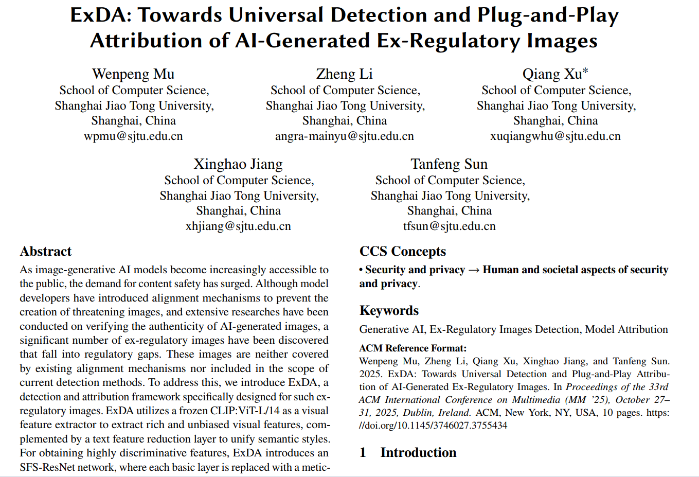
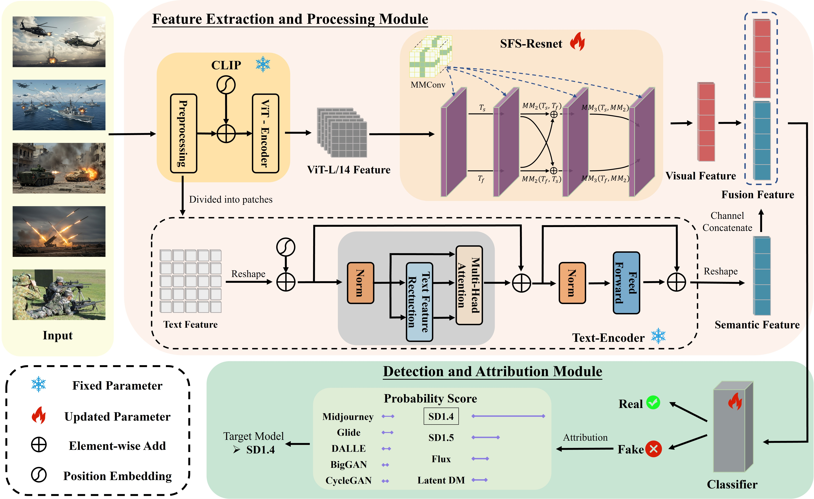
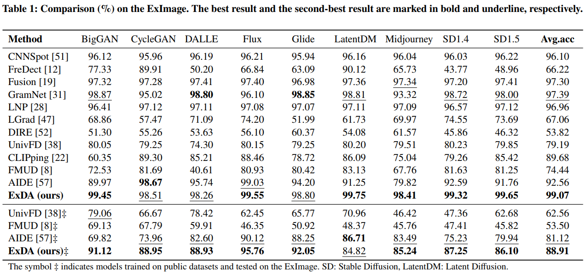
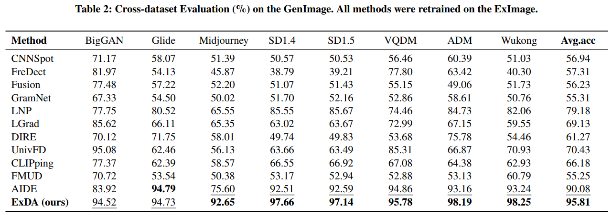
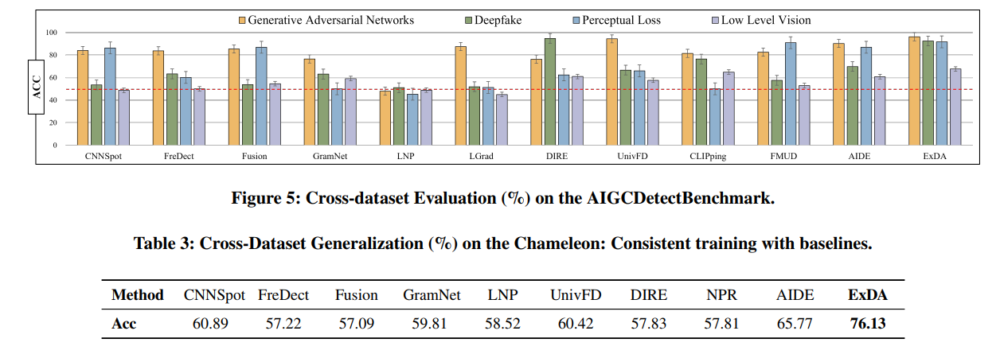

# [ExDA: Towards Universal Detection and Plug-and-Play Attribution of AI-Generated Ex-Regulatory Images]

<p align="center">
  
  
  
  
</p>

<div align="center">
  <b><a href="README.md">中文</a></b> •
  <a href="README_en.md">English</a>
</div>

---

This project is the official implementation of the conference paper **https://doi.org/10.1145/3746027.3755434** (ACM MM'25).

## 📰 Latest Updates
-[2025-08-28] 🎉 我们整理发布ExImage数据集，现在可以访问[Google Drive](https://drive.google.com/file/d/1s2JYbZyMe-SzWjkja9tlZFrzIJiFhwI-/view?usp=sharing)下载啦！！

-[2025-08-17] 🎉 我们更新了绘制功率谱图的关键步骤说明，可以按照【快速开始】中的指引进行绘制！

-[2025-08-15] 🎉 我们最新的一篇综述工作已经被ACM Computing Surveys期刊接受，题目为[Advancements in AI-Generated Content Forensics: A Systematic Literature Review](https://doi.org/10.1145/3760526)。欢迎各位同仁阅读并批评指正，如对您的研究有帮助，欢迎**引用**！

-[2025-08-15] 🎉 我们更新了测试代码validate.py和工具文件earlystop.py，可以按照【快速开始】中的指引进行测试！

-[2025-08-11] 🎉 我们更新了预训练权重，现在可以访问[Google Drive](https://drive.google.com/file/d/1K7Otqbcx5vkNEciRtMgXXF9IVbb5cEgi/view?usp=sharing)下载啦！

-[2025-08-10] 🎉 我们更新部分代码，在data/文件夹下可以查看ExImage和GenImage功率谱图！

-[2025-07-06] 🎉 我们论文正式被ACM MM'25接受！

## 🔍 Abstract
With the proliferation of generative AI models for image synthesis, public demand for content safety has surged. While model developers have introduced alignment mechanisms to prevent harmful content generation, and extensive research exists on verifying AI-generated images' authenticity, a significant category of "Ex-Regulatory Images" remains undetected - these images evade existing regulatory frameworks and detection methods.

To address this, we propose ExDA, a detection and attribution framework specifically targeting these unregulated images. Our system employs frozen CLIP:ViT-L/14 as a visual feature extractor to obtain unbiased features, combined with a text feature dimensionality reduction layer to unify semantic styles. For enhanced discriminative features, ExDA introduces SFS-ResNet with our novel "Multi-Channel Boundary Convolution (MMConv)" modules replacing baseline layers. The framework also integrates plug-and-play multi-generation-model attribution components.

Given the lack of public datasets for Ex-Regulatory Images, we constructed ExImage containing 72,000 such images. Experiments show ExDA achieves 99.07% average detection accuracy on ExImage, outperforming GenImage and challenging Chameleon datasets by +5.73% and +10.36% respectively. Remarkably, ExDA also excels in attribution tasks, demonstrating exceptional capability in identifying generative model fingerprints.

Project code is available at: https://github.com/mwp-create-wonders/ExDA

<p align="center">
  
  <br>
  <em>Figure 1: Paper cover</em>
</p>

## ⚙️ Model Architecture
Our core model **ExDA** comprises three components:
1. **Visual Feature Extractor (CLIP:ViT-L/14)**
2. **Specialized Feature Processor (SFS-ResNet)**
3. **Decoupled Text Encoder**

Key innovations:
1. **MMConv modules** replace baseline layers in SFS-ResNet to filter redundancy and capture high-frequency discriminative features
2. **Text feature dimensionality reduction layer** minimizes content interference, focusing detection on generation artifacts

<p align="center">
  
  <br>
  <em>Figure 2: System architecture</em>
</p>

## ✨ Key Features
* **Efficient Detection & Attribution Framework**: Specialized framework for accurate detection and reliable tracing of Ex-Regulatory Images
* **Robust Visual Processing**: Frozen CLIP backbone ensures unbiased features, combined with MMConv-based SFS-ResNet for effective feature extraction
* **Content Interference Mitigation**: Decoupled text encoder reduces semantic content impact on detection
* **Plug-and-Play Attribution**: Expandable plugin enables small-sample learning of generation model fingerprints
* **First-of-its-kind Dataset**: ExImage addresses the critical gap in Ex-Regulatory Image detection research

## 📚 ExImage Dataset
Download from [Google Drive](https://drive.google.com/file/d/1s2JYbZyMe-SzWjkja9tlZFrzIJiFhwI-/view?usp=sharing)

## 🚀 Quick Start

### 1. Environment Setup
```bash
git clone https://github.com/mwp-create-wonders/ExDA.git
cd ExDA

conda create -n exda_env python=3.8
conda activate exda_env

pip install -r requirements.txt
```

### 2. Dataset Preparation
Download ExImage dataset from [Google Drive](https://drive.google.com/file/d/1s2JYbZyMe-SzWjkja9tlZFrzIJiFhwI-/view?usp=sharing) and extract to `data/`

### 3. Pretrained Models
Download weights from [Google Drive](https://drive.google.com/file/d/1K7Otqbcx5vkNEciRtMgXXF9IVbb5cEgi/view?usp=sharing) and place in `checkpoints/`

### 4. Evaluation
```bash
python validate.py --arch=CLIP:ViT-L/14 --ckpt=checkpoints_our/~.pth --result_folder=result/xxx --real_path=xxx --fake_path=xxx --key=xxx
```

### 5. Training
(This section will be updated soon)

### 6. Power Spectral Diagrams
For generating diagrams, refer to `data/Enhanced.py` and note the residual extraction function:
```python
def _extract_residual(self, image, denoiser_sigma=1):
    image_cpu = (image.cpu().numpy() * 255).astype(np.uint8)
    denoised = cv2.fastNlMeansDenoising(image_cpu, h=denoiser_sigma)
    return image - torch.tensor(denoised/255.0, device=self.device).float()
```

## 📊 Experimental Results
Performance comparisons on multiple benchmarks:

### ExImage Dataset
<p align="center">
  
  <br>
  <em>Figure 3: Accuracy on ExImage</em>
</p>

### GenImage Dataset
<p align="center">
  
  <br>
  <em>Figure 4: Accuracy on GenImage</em>
</p>

### Cross-Dataset Evaluation
<p align="center">
  
  <br>
  <em>Figure 5: Accuracy on AGGCBenchmark and Chameleon</em>
</p>

## 🎓 Citation
```bibtex
@inproceedings{ExDA_mwp2025,
  author    = {Wenpeng Mu, Zheng Li, Qiang Xu, Xinghao Jiang, and Tanfeng Sun},
  title     = {ExDA: Towards Universal Detection and Plug-and-Play Attribution of AI-Generated Ex-Regulatory Images},
  booktitle = {Proceedings of the 33rd ACM International Conference on Multimedia (MM'25)},
  year      = {2025}
}
```

## 🙏 Acknowledgments
* Shanghai Jiao Tong University's School of Computer Science (Cyberspace Security)
* Contributors: Li Minyang, Yuan Yifan, Li Zheng, Qiu Hao, Jiang Nan, Wang Jiyun, Xie Taiyi, Zhou Xinbu, Yang Keyi
* Code structure inspired by  karsh Ojha et al. CVPR 2023

  [1] karsh Ojha, Yuheng Li, and Yong Jae Lee. 2023. Towards Universal Fake Image Detectors that Generalize Across Generative Models. In IEEE/CVF Conference on Computer Vision and Pattern Recognition, CVPR 2023. 24480–24489.
